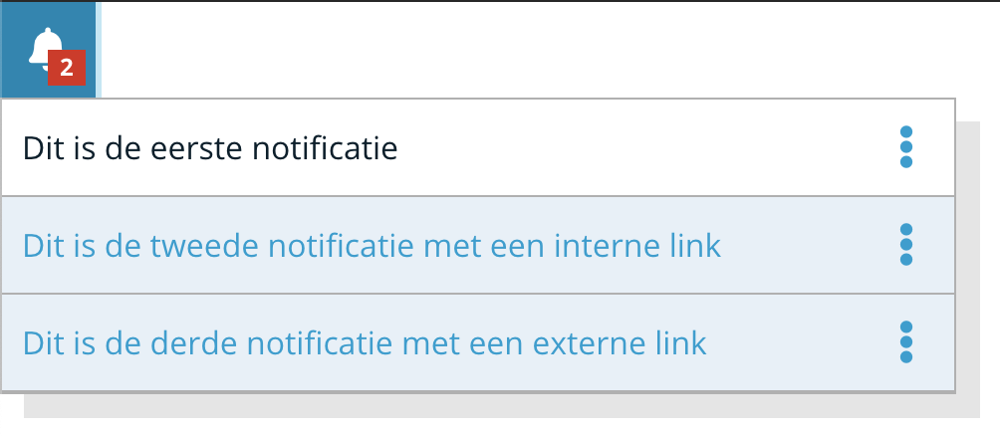

# Notification Widget UI (Angular)

This is the Angular 7+ UI for a notification center. It is matched by a [corresponding back-end service](https://github.com/digipolisantwerp/notification_service_nodejs) which is needed when running it. Implement this in your BFF.



There is a demo app, see below for instructions on running it.

## How to use

### Installing

```sh
> npm install @acpaas-ui-widgets/ngx-notification-widget
```

### Using

A BFF service should be running on which the endpoints are configured (see the example app for how to provide such a BFF).

Prerequisite: set up [Antwerp UI](https://github.com/digipolisantwerp/antwerp-ui_angular/) for your application.

Import the component in your module:

```ts
import { NotificationWidgetModule } from '@acpaas-ui-widgets/ngx-notification-widget';

@NgModule({
  imports: [
    ...,
    NotificationWidgetModule
  ],
  ...
})
```

### In your template:

```html
<aui-notification-widget
url="api/url" >
</aui-notification-widget>
```


### Supported attributes

- **url**: the URL of the back-end service feeding this widget


## Build

Run `ng build` to build the widget for retesting in the application. The build artifacts will be stored in the `dist/` directory. Use the `--prod` flag for a production build.

## Running unit tests

Run `ng test` to execute the unit tests via [Karma](https://karma-runner.github.io).
## Run the demo app

```sh
> npm install
> npm start
```

Browse to [localhost:4200](http://localhost:4200)

## Contributing

We welcome your bug reports and pull requests.

Please see our [contribution guide](CONTRIBUTING.md).

## Support

Joeri Sebrechts (<joeri.sebrechts@digipolis.be>)

## License

This project is published under the [MIT license](LICENSE.md).

This project was generated with [Angular CLI](https://github.com/angular/angular-cli) version 7.3.10.
